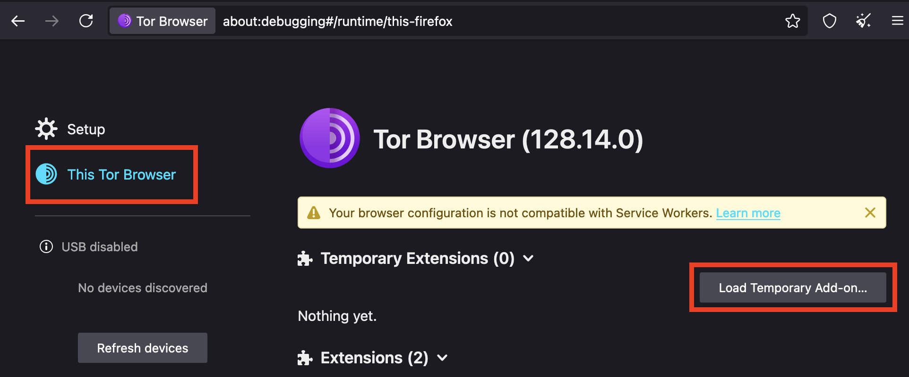
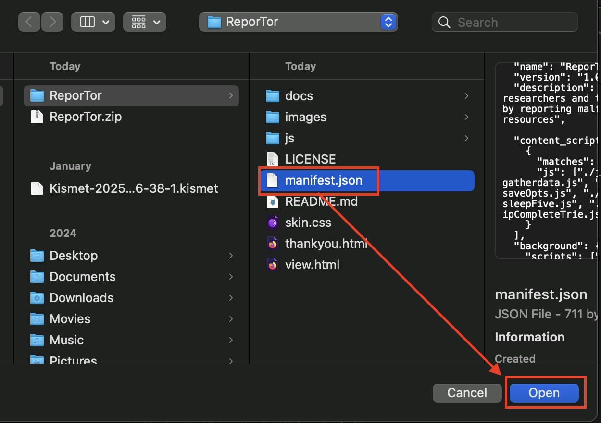
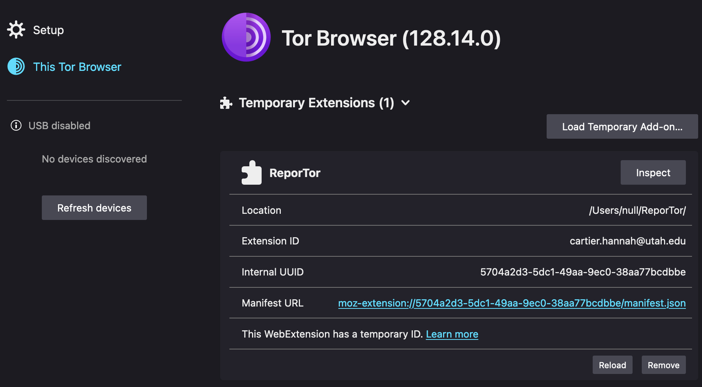
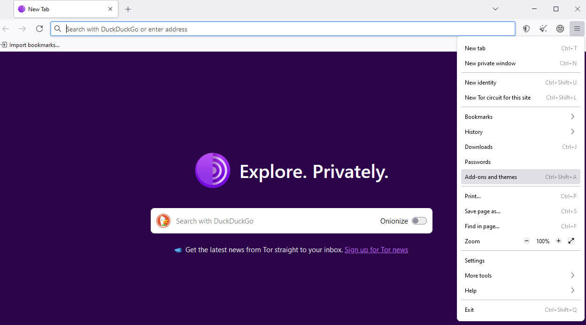
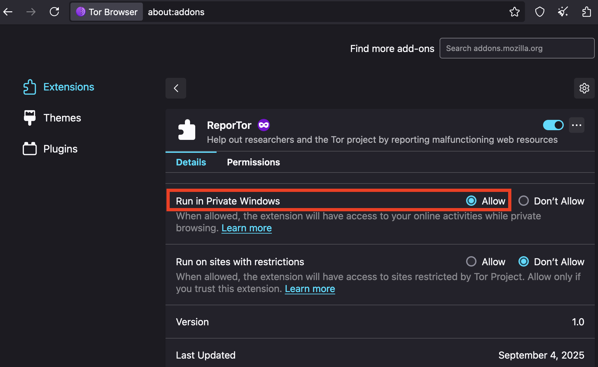
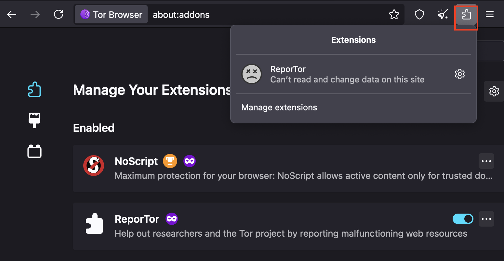

# ReporTor
**One of the Tor Projects open research questions is How to measure websites issues without compromising users' safety.  
This Webextension takes steps towards acomplishing that goal by asking Tor users for a limited amount of data, which will be used by
researchers to explore trends in network accessibility via Tor.**

## Installation
Download the Zip file containing the extension from Github.

Release version:
https://github.com/sameer-patil/reportor

Extract the Zip file.

Launch the tor browser and enter the URL `about:debugging`. This will take you to the page below. On the right select "This Tor Browser" and then click the Button that says "Load Temporary Addon"

In the file explorer, select the manifest.json file and press "open"

The extension will then show up on the main screen. An example of a successful install is shown below.

Next configure the extension permissions by click the application menu in the far right of the toolbar and select "Add-ons and themes".

You will see the extension here. If not, click on "Extensions" in the left sidebar, find ReporTor in the list and click on it. 

Next, enable the extension by toggling the switch in the top right to "ON" and under "Run in Private Windows", click the "Allow" button as shown below

Now when you click on the puzzle icon you should see the ReporTor extension listed.
