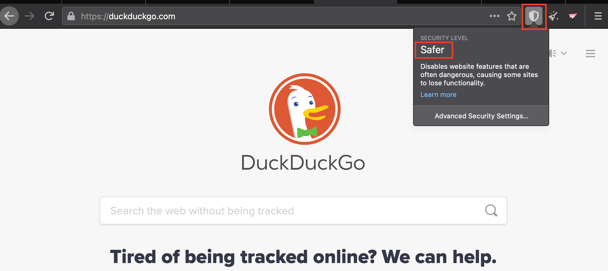

##Finding the Tor Browser's Security Setting
Knowing what security setting causes a web resource to malfunction will help us replicate the problem and come up with solutions.

To find the security setting, click the shield icon on the right side of the browser and look at the dropdown menu.
  