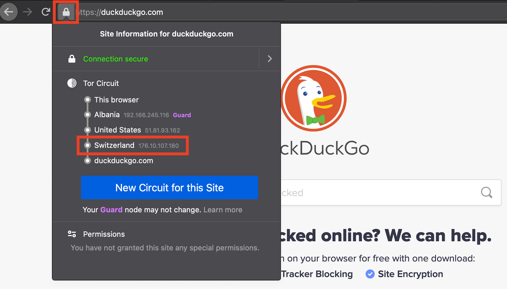

##Finding the exit node for this circuit
Reporting the exit node can help us determine if traffic is blocked from a specific address or country.
This is NOT information that can be used to identify you, since all exit nodes are published online.  

To see your circuit for the current tab, click the lock icon to the left of the search bar.
The exit node is the last IP address that appears BEFORE your destination.

